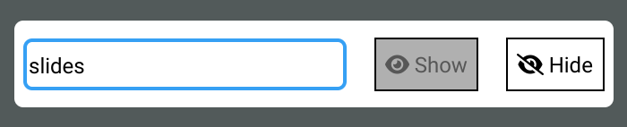

# estudiante

`estudiante` is a small tool helping with `iframe` presentations/demonstrations inside of `lively.next`. 



## Usage

```js
import { part } from "lively.morphic";
import { Estudiante } from "estudiante/ui.cp.js";
part(Estudiante).openInWorld()
```

## Open Problems

- auto focus of `iframe` node after unhiding slides does not work
- `ViewModel` is sometimes not attached upon first import. Saving `ui.cp.js` resolves this usually.

## License

MIT (c) 2023 Linus Hagemann.